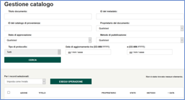

# Manuale di installazione e configurazione

Questo manuale fornisce tutte le indicazioni utili per l'installazione e la configurazione dell'applicazione RNDT.

I requisiti minimi per eseguire il software sono i seguenti:

- Sistema operativo (Linux o Windows)
- Java JDK 1.8
- Apache Tomcat 8.5
- DBMS MySQL 5.7.18
- OpenLDAP

## Contenuto

La cartella di distribuzione contiene i seguenti file e cartelle:

- DB
  - [```Database.sql```](../DB/Database.sql)
    Script SQL di creazione del database dei metadati
- LDAP
  - [```Ente.ldif```](../LDAP/Ente.ldif)
    Esempio di alcuni enti. Va caricata in LDAP con un programma adatto, ad esempio Apache Directory Studio.
  - [```Users.ldif```](../LDAP/Users.ldif)
    Esempio di alcuni utenti. Va caricata in LDAP con un programma adatto, ad esempio Apache Directory Studio.
  - [```Groups.ldif```](../LDAP/Groups.ldif)
    Gruppi (Ruoli) per gli utenti.
- [```Sorgenti```](../Sorgenti/)
    Sorgenti java comuni alle webapp geoportalRNDTPA e geoportalRNDTAdm
- Webapp
  - [```geoportalRNDTPA```](../geoportalRNDTPA/)
    Webapp per la gestione delle PA (ruolo di tipo &quot;publisher&quot;)
  - [```geoportalRNDTAdm```](../geoportalRNDTAdm/)
    Webapp per la gestione amministrativa (ruolo di tipo &quot;administrator&quot;)

**NOTA**: tutte le applicazioni sono in formato leggibile (PHP, Javascript, XML) quindi gli unici sorgenti necessari sono quelli java che costituiscono la libreria ```geoportalRNDT*/WEB-INF/lib/geoportalRNDT.jar```.

## Creazione DB metadati

La creazione del DB dei metadati viene effettuata tramite esecuzione degli script SQL di installazione del DB presenti nella cartella [```DB```](../DB/).

Gli script includono la creazione del database con nome **geoportal**; questo nome può essere modificato facendo attenzione che deve essere modificato coerentemente anche nel file delle webapp.

Si consiglia di creare un utente specifico per il DB dei metadati, ad esempio un utente _geoportaluser_ con permessi &quot;full&quot; sullo schema. L&#39;utente e la password devono poi essere inserite nella configurazione delle webapp.

**NOTA**: per funzionare correttamente, il database sistema deve contenere almeno un Ente e un Tipo Ente.

## Installazione webapp

Le webapps da installare sotto Tomcat sono le seguenti:

- [```geoportalRNDTPA```](../geoportalRNDTPA/)
- [```geoportalRNDTAdm```](../geoportalRNDTAdm/)

L&#39;installazione consiste nella copia delle webapp nella cartella ```<tomcat>/webapps```. La copia deve essere effettuata quando Tomcat è in stato di stop.

## Configurazione Tomcat

Tomcat non necessita di configurazioni particolari, ma sono da considerare le seguenti:

- Tomcat 8.5 verifica continuamente la cache ed effettua di default molte segnalazioni nei log. Per evitarle va aumentata la dimensione della cache e messo a **SEVERE** il livello di segnalazione:

  - in ```conf/context.xml```:
  
    ```xml
    <Resources cachingAllowed="true" cacheMaxSize="100000"/>
    ```
  - in ```conf/logging.properties```:
  
    ```txt
    org.apache.catalina.webresources.Cache.level = SEVERE
    ```
    
- Per gestire le chiamate ad altri siti in Tomcat va abilitato il CORS su tutti i metodi.
  - ```conf/web.xml```:
  
```xml
<filter>
  <filter-class>org.apache.catalina.filters.CorsFilter</filter-class>
  <init-param>
    <param-name>cors.allowed.origins</param-name>
    <param-value>*</param-value>
  </init-param>
  <init-param>
    <param-name>cors.allowed.methods</param-name>
    <param-value>GET,POST,HEAD,OPTIONS,PUT</param-value>
  </init-param>
</filter>
```

## Configurazione webapps

Le webapp applicative sono il motore di gestione dei metadati. Le due webapp, [```geoportalRNDTPA```](../geoportalRNDTPA/) e [```geoportalRNDTAdm```](../geoportalRNDTAdm/), sono uguali, a parte le seguenti differenze:

- ```META-INF/context.xml``` per il nome della webapp;
- ```WEB-INF/classes/logging.properties``` per il nome del log file (ed eventualmente il livello);
- ```WEB-INF/classes/gpt/config/gpt.xml``` per il parametro catalog.list.version, il reverseproxy e i protocolli attivati;
- ```WEB-INF/classes/gpt/metadata/schemas.xml``` per gli schemi attivati;
- ```WEB-INF/classes/gpt/metadata/dc/dc-definition.xml``` per l&#39;editabilità dello schema;
- ```catalog/harvest/harvestBody.jsp``` per le differenti opzioni sui cataloghi.

La scelta di quale webapp lanciare dipende dal ruolo collegato al login: se il ruolo è di tipo amministrativo, allora viene lanciata [```geoportalRNDTAdm```](../geoportalRNDTAdm/), altrimenti [```geoportalRNDTPA```](../geoportalRNDTPA/).

Dato che la webapp [```geoportalRNDTAdm```](../geoportalRNDTAdm/) è più completa, se non si ha la necessità di separare la parte amministrativa da quella per gli Enti che devono documentare i metadati nel catalogo, è possibile utilizzare anche solo questa applicazione, modificando opportunamente il file ```configuration.php``` di Joomla e il file di configurazione ```gpt.xml``` settando a _true_ il parametro di aggiornamento dell&#39;indice Lucene.

Nel seguito verranno descritti solo i parametri che sono specifici nell&#39;ambito del progetto RNDT; per tutti gli altri, così come per tutte le altre configurazioni, si rimanda alla documentazione presente sul sito [https://github.com/Esri/geoportal-server](https://github.com/Esri/geoportal-server).

I file da configurare sono i seguenti:

- ```<geoportalwebapp>/WEB-INF/classes/gpt/config/gpt.xml```:
  Contiene tutti i parametri di configurazione, tra cui l&#39;accesso al server LDAP
- ```<geoportalwebapp>/META-INF/context.xml```:
  Contiene i parametri di connessione al DB
  
  ### gpt.xml
  
Si consiglia di scorrere con attenzione il file ```<geoportalwebapp>/WEB-INF/classes/gpt/config/gpt.xml``` per verificare le configurazioni presenti. Si riportano di seguito quelle che maggiormente dipendono dall&#39;applicazione che viene installata:

- **Server di posta** utilizzato per le notifiche di harvesting completato: sostituire i valori dei parametri relativi ai dati del server (```smtpHost```), l&#39;utente mittente (```siteEmailAddress```) e le credenziali (```username``` e ```password``` in ```smtpAuth```):

    ``` txt
    smtpHost="server-posta.dominio.it"
    smtpPort="25"
    siteEmailAddress="posta@dominio.it"
    <smtpAuth
      username="user"
      password="pass"
      encrypted="false"/>
    ```
    
 - **Indice Lucene** (percorso assoluto o relativo):

    ``` txt
    <lucene
      indexLocation="C:\geoportale\LuceneIndex\catalog"
    ```
  
  ### context.xml

Nel file ```context.xml``` sono presenti i parametri per la connessione al DB:

  ```xml
  <Context crossContext="true" debug="0" docBase="geoportalRNDTAdm" path="/geoportalRNDTAdm" reloadable="true">
    <Resource auth="Container" driverClassName="com.mysql.jdbc.Driver" maxActive="20" maxIdle="10" maxWait="-1&" name="jdbc/gpt" password="xxxxxxxxx" type="javax.sql.DataSource" url="jdbc:mysql://macchinaDB:3306/geoportal?zeroDateTimeBehavior=convertToNull" username="user"/>
  </Context>
  ```

dove:

```docBase```="&lt;nome della webapp&gt;"

```path```="/&lt;nome della webapp&gt;"

```password```="<password di connessione al db per l&#39;utente gestore dei metadati>"

```url```= …3306/<nome dello schema del db&gt;

``username``="<nome dell&#39;utente gestore dei metadati>"

## Test

Ogni componente può essere testato separatamente, in modo da individuare eventuali errori.

### PHP

Per il test del PHP è di uso comune utilizzare la seguente funzione:

```php
<?php
// Show all information, defaults to INFO\_ALL
phpinfo();
?>
```

Creando un file testPHP.php e lanciandolo da browser, il browser deve mostrare una pagina con tuti i settaggi del PHP.

### Webapps

Per le webapp, si consiglia di effettuare i test richiamando direttamente Tomcat sulla porta 8080, richiamando le pagine:

geoportalRNDT*/catalog/identity/login.page

Deve apparire la pagina di login:


Inserire delle credenziali valide, registrate in LDAP; viene, quindi, visualizzata una pagina vuota.

Richiamare, sulla stessa scheda del browser, la seguente pagina:

geoportalRNDT*/catalog/publication/manageMetadata.page

Deve apparire la pagina di gestione del catalogo:



In questo caso il catalogo è correttamente configurato.

Se appare il messaggio

```**Attenzione il catalogo risulta scollegato; effettuare un logout e poi nuovamente un Login**```

vuol dire che il login non ha avuto successo e questo può essere dovuto ad un login/password errato o ad un problema di comunicazione con LDAP.

